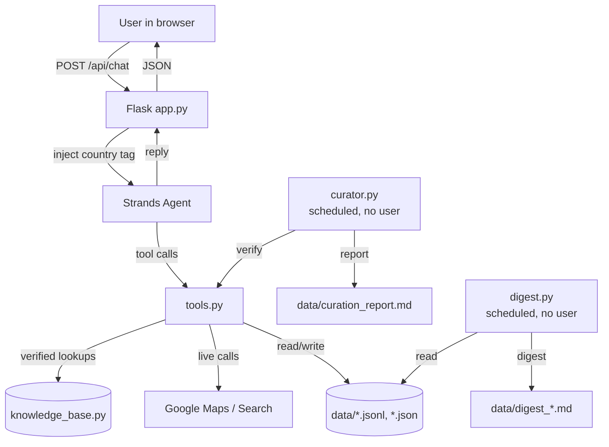

# Strivend — Project Organization & Full Build Guideline

Reorganized plan + start-to-finish guideline matching the actual codebase.

---

## Part 1 — The Reorganized Plan

### 1.1 Project Identity

| Item | Value |
|---|---|
| Name | **Strivend** |
| Tagline | A background copilot for international students |
| Agent name (in-chat) | **Strivend** (unify — `main.py` currently says "Scholaris") |
| Track | Everyday Agents — "Agents for Humans Hackathon" |
| Stack | Strands Agents SDK · Amazon Bedrock (Claude Sonnet 4.6) · Flask · Tailwind (CDN) |
| License | MIT |

> ⚠️ Inconsistency to fix: `main.py` calls the agent *Scholaris*; `app.py` and the UI call it *Strivend*. Pick **Strivend** everywhere.

---

### 1.2 UI / Storage Backlog

**Must-have (blocks a usable demo):**
1. ✅ Session storage (persisted to `data/sessions_meta.json`)
2. ✅ Previous chat history (restored on reload)
3. ✅ Chat CRUD (create / read / update-country / delete)
4. ✅ New-message overflow fix (flex `min-h-0` + scroll inside `#messages`)
5. ✅ Sidebar system (with mobile drawer + backdrop)
6. ✅ Welcome message / empty state
7. ✅ Dark mode color fix (token-based `--vars`)
8. ✅ Favicon (inline SVG data URI)
9. ⬜ Data flow diagram (for README)
10. ✅ Background (static slate palette, replacing animated blobs)
11. ✅ Project name decided → **Strivend**
12. ✅ Tailwind via CDN with inline `<style>` tokens

**Country-context features:**
1. ✅ Country pinned on top of chat (`PATCH /api/sessions/<id>/country`)
2. ✅ 30-day retention (`SESSION_RETENTION_DAYS`, `_purge_expired_sessions`)
3. ✅ Chat delete option (with `confirm()`)
4. ✅ Country flag shown in sidebar + header (inline SVG, no emoji dependency)

---

### 1.3 Application / Agent Behavior

1. ✅ Time optimization (low temperature, on-demand digest is Bedrock-free)
2. ⬜ Memory management (currently in-memory per process → move to AgentCore)
3. ✅ Delay animation (typing indicator with 3-dot bounce)
4. ✅ No image generation / no forgery (system-prompt rule #9)
5. ✅ No hallucinated facts (rule #1, VERIFY/NOT_COVERED propagation)
6. ✅ EU/Schengen awareness (rule #10, `plan_short_trip_budget`)

---

### 1.4 Use Cases (all implemented as tools)

| Use case | Tool | Status |
|---|---|---|
| Where do I submit documents? (nearest office) | `find_nearby_office` | ✅ live Places API |
| Bicycle registration in Japan | `get_misc_local_requirement` | ✅ VERIFY-flagged |
| Language certifications + related jobs | `get_language_certification_info` | ✅ |
| Germany → Poland weekend trip budget | `plan_short_trip_budget` | ✅ + Schengen reminder |
| Work-hour quota tracking | `log_work_day` + `check_quota_remaining` | ✅ Germany verified |
| Arrival countdown (Anmeldung in 14 days) | `plan_arrival_countdown` | ✅ chains into `add_deadline` |

---

### 1.5 GitHub To-Do

- [ ] **README** — drafted; needs **data flow diagram** inserted
- [ ] **LICENSE** — MIT (referenced in README but not yet a file)
- [ ] **Bash commands clarification** — split into "First-time setup" vs "Every session" vs "Optional env vars"
- [ ] **`.gitignore`** — must include `data/`, `.venv/`, `__pycache__/`, `*.pyc`, `.env`
- [ ] **`static/` folder** — move `index.html` → `static/index.html`
- [ ] **Confirm `curator.py` + `digest.py`** are committed (imported by `app.py`)
- [ ] **Screenshots** — welcome, chat with flags, dark mode, curator run
- [ ] **Demo script** — 90-second click path for judges

---

### 1.6 Known Inconsistencies to Fix Before Publishing

| # | Where | Problem | Fix |
|---|---|---|---|
| 1 | `main.py` vs `app.py` | Agent named Scholaris vs Strivend | Rename to Strivend everywhere |
| 2 | `app.py` imports | `curator` / `digest` presence unverified | Confirm both files committed |
| 3 | `index.html` location | README says `static/index.html`; file is at root | `mkdir static && mv index.html static/` |
| 4 | `.gitignore` | Not present | Create it (see Phase 1) |
| 5 | LICENSE | README says MIT, no file | Add standard MIT text |
| 6 | `_purge_expired_sessions` | Runs on GET only | Optionally call from `@app.before_request` |
| 7 | Welcome chips list | Hardcoded 5 countries but free-text works | Fine — UI already labels them "curated in depth" |
| 8 | South Korea flag SVG | Approximate taegeuk | Acceptable; note as "stylized" |
| 9 | `plan_short_trip_budget` | No entry for Poland (your own use case) | Add Poland to `BUDGET_BASELINES` or rely on honest NOT_COVERED |
| 10 | Duplicate `Strivend.txt` | Pasted twice | Keep one |

---

## Part 2 — Full Guideline: Start to Finish

### Phase 0 — Prerequisites

```bash
# Python 3.11+
python --version

# AWS CLI configured with a Bedrock-enabled profile
aws configure --profile bedrock
# Region must have Claude Sonnet 4.6 enabled (e.g. us-west-2)

# Optional but recommended
export GOOGLE_MAPS_API_KEY="..."      # find_nearby_office
export GOOGLE_SEARCH_API_KEY="..."    # find_official_source
export GOOGLE_SEARCH_CX="..."         # Programmable Search Engine ID
```

### Phase 1 — One-Time Setup

```bash
git clone <your-repo> strivend
cd strivend

python -m venv .venv
source .venv/bin/activate          # Windows: .venv\Scripts\activate
pip install -r requirements.txt

mkdir -p static data
mv index.html static/index.html    # per README expectation

cp .env.example .env               # if you create one; else export manually
```

**Create `.gitignore`:**

```gitignore
.venv/
__pycache__/
*.pyc
.env
data/
.DS_Store
*.log
```

**Create `LICENSE`** — standard MIT text, year 2026, your name.

### Phase 2 — Every Session

```bash
cd strivend
source .venv/bin/activate

export AWS_PROFILE=bedrock
export AWS_REGION=us-west-2

# Optional (only if you need live office/search lookups)
export GOOGLE_MAPS_API_KEY="..."
export GOOGLE_SEARCH_API_KEY="..."
export GOOGLE_SEARCH_CX="..."

python app.py
# → http://127.0.0.1:5000
```

CLI alternative:

```bash
python main.py
```

Standalone agents (no web server):

```bash
python curator.py    # writes data/curation_report.md
python digest.py     # writes data/digest_<session_id>.md
```

### Phase 3 — Verify the Demo Path

Run this exact sequence once before recording/submitting:

1. Open `http://127.0.0.1:5000`
2. Pick **Germany** from welcome chips → flag appears in header
3. *"I worked 6 hours today"* → `log_work_day` fires, full-day classification shown
4. *"How many work days do I have left this year?"* → quota summary
5. *"I'm moving to Berlin on 2026-10-01"* → `plan_arrival_countdown` chains into `add_deadline`
6. Click **Check my status** → digest appears with dashed-avatar "Digest agent"
7. Click **Verify country data** → curator runs (1–2 min), dashed "Curator agent" reply
8. *"I'm in Germany and want to visit Poland next weekend, rough budget?"* → `plan_short_trip_budget` + Schengen reminder
9. *"Where is the nearest Ausländerbehörde in Berlin?"* → live Places result (or honest NOT_CONFIGURED)
10. Toggle dark mode → verify contrast
11. Reload page → chat history survives, country flag persists
12. Delete a chat → confirmation dialog, session removed

### Phase 4 — Add the Data Flow Diagram

Paste this into the README under a new `## Data flow` section. GitHub renders Mermaid natively:



### Phase 5 — Pre-Publish Checklist

- [ ] Agent name unified (Strivend everywhere)
- [ ] `index.html` in `static/`
- [ ] `.gitignore` committed, `data/` excluded
- [ ] `LICENSE` file present
- [ ] README has: overview, quickstart, env vars, use cases, data flow diagram, limitations, next steps
- [ ] `requirements.txt` matches actual imports
- [ ] All 5 curated countries have at least placeholder entries
- [ ] Every `VERIFY` entry is visibly flagged in output
- [ ] Screenshots or a GIF in README
- [ ] 90-second demo script written out
- [ ] `data/` regenerates cleanly on first run (delete it, run app, confirm)

### Phase 6 — Post-Hackathon Roadmap

1. Replace JSON files with SQLite/Postgres for real multi-user persistence
2. Deploy to Bedrock AgentCore → durable sessions, real memory
3. Verify Italy, France, Japan, South Korea entries (replace every VERIFY)
4. Add Poland, Spain, Netherlands, Canada, Australia, US to `BUDGET_BASELINES` and the rest
5. Push notifications for deadlines (email/SMS via SES or SNS)
6. Wire `digest.py` to a real cron / AgentCore scheduled invocation

---

## Quick Answers to Your Three "To Do: GitHub" Items

**Diagram Add** — Use the Mermaid block in Phase 4. GitHub renders it natively; no external image needed.

**License** — Create a `LICENSE` file at repo root with standard MIT text. README already says MIT; this is just the missing file.

**Bash commands clarification** — Split into the three blocks in Phase 1 / Phase 2: *one-time setup*, *every session*, *optional env*. The current README lumps them together, which is why it reads as cluttered.

---