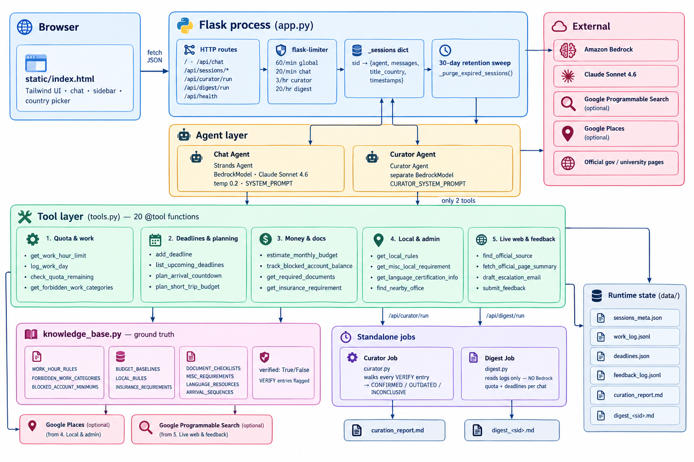
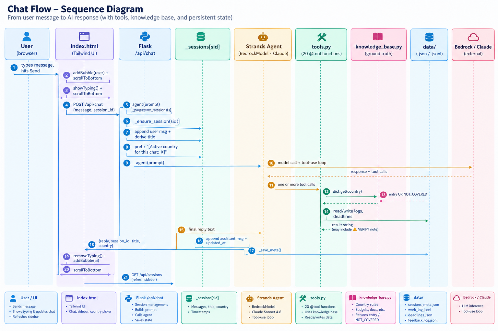
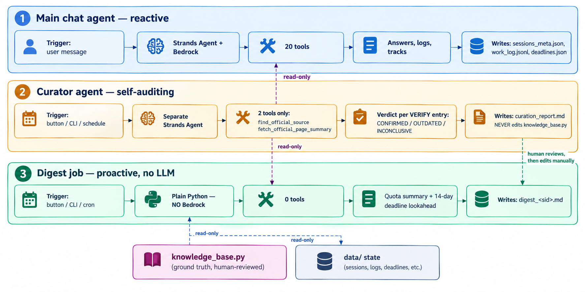

# Strivend — International Student Copilot

An AI agent built with the [Strands Agents SDK](https://strandsagents.com) that
runs quietly in the background for international students — tracking
work-hour compliance, deadlines, budgeting, and the local rules that are
easy to miss — currently covering Germany, Italy, France, Japan, and South
Korea.

**Built with:** Strands Agents SDK, Amazon Bedrock, Claude, Python, Flask.
**Hackathon track:** Everyday Agents ("Agents for Humans Hackathon")

**Problem:** Existing tools either help you get *into* a country (visa
application assistants) or track one narrow thing in one country (a work-day
counter for Germany). Nothing tracks the whole picture — quota usage,
renewal deadlines, budget sanity, and local norms — continuously, in the
background, the way the student actually experiences it: as one ongoing
situation, not five separate lookups.

**Who it's for:** International students already living abroad (or about
to move), who need one place that remembers their situation instead of
five bookmarked government pages.

---

## Design philosophy

Same discipline as the rest of this project family:

- **Germany is the fully verified reference country.** Italy, France,
  Japan, and South Korea are starter entries explicitly marked `VERIFY` in
  `knowledge_base.py` — the agent is instructed to always pass that caveat
  to the user rather than presenting an unconfirmed number as fact.
- **It never invents a compliance figure.** If a tool returns `NOT_COVERED`
  or a `VERIFY` note, the agent says so honestly instead of guessing.
- **It logs, it doesn't overwrite.** `submit_feedback` saves corrections
  for a human to review — a single user report never silently changes what
  every other user is told.

---

## Architecture

High-level view of how a message moves through the system, and how the
two standalone agents (curator, digest) fit in alongside the main chat
agent.



---

## Data flow — one turn, end to end

Sequence of what actually happens when a student sends a message. The
country tag injection (rule 0) is what lets the student stop repeating
"Germany" every message.



---

## Where the two standalone agents fit

`curator.py` and `digest.py` are **not** part of the chat loop. They run
on their own schedule (or via buttons in the UI header), prove the system
is a background agent rather than a wait-to-be-asked chatbot, and never
overwrite `knowledge_base.py` automatically.



Both reports surface in the chat UI as messages with a **dashed-border
avatar** and a distinct name ("Curator agent" / "Digest agent") plus a
small badge — visually unmistakable that they came from a separate
on-demand agent run, not the main chat agent answering normally.

---

## Running it locally

```bash
python -m venv .venv
source .venv/Scripts/activate      # Mac/Linux: source .venv/bin/activate
pip install -r requirements.txt

export AWS_PROFILE=bedrock
export AWS_REGION=us-west-2        # match your enabled Bedrock region

# Optional — enables find_nearby_office (live Google Places lookups).
# Without it, the tool honestly reports NOT_CONFIGURED instead of guessing.
export GOOGLE_MAPS_API_KEY=your-key-here

# Optional — enables find_official_source (live web search for countries
# outside the curated five). Without it, also honestly NOT_CONFIGURED.
export GOOGLE_SEARCH_API_KEY=your-key-here
export GOOGLE_SEARCH_CX=your-programmable-search-engine-id

python app.py                      # web UI — recommended
# python main.py                   # terminal version, useful for quick testing
```

`app.py` serves `index.html` from a `static/` folder (`static_folder="static"`)
— place `index.html` at `static/index.html` relative to `app.py`.

Open **http://127.0.0.1:5000**. Try:

- "I worked 6 hours today in Germany"
- "How many work days do I have left this year?"
- "Add a deadline: residence permit renewal on 2026-11-15"
- "What deadlines do I have coming up?"
- "Give me a rough monthly budget for Germany"
- "What local rules should I know about in Germany?"

---

## Agentic workflows (beyond reactive Q&A)

These are the pieces built specifically to demonstrate autonomous, multi-step
agent behavior — not just "the agent can answer a question when asked":

| Script/behavior | What it demonstrates |
| --- | --- |
| `curator.py` | A **separate agent**, with no user in the loop, that walks every `VERIFY` entry in `knowledge_base.py`, researches it live via `find_official_source` + `fetch_official_page_summary`, and writes `data/curation_report.md` with a CONFIRMED / OUTDATED / INCONCLUSIVE verdict. The system deciding what it doesn't know and going to check, on its own. |
| `digest.py` | A **scheduled, unprompted** job that reads on-disk state and produces a "what needs your attention this week" digest per chat (quota usage + upcoming deadlines, urgency-flagged). Proves the app is a background agent, not a chatbot that waits to be asked — wire it to cron or Bedrock AgentCore's scheduled invocation for a real deployment. |
| `plan_arrival_countdown` (tool) | Given just a move-in date, the agent works out the **dependency order** of arrival steps itself (insurance before enrollment, Anmeldung's hard 14-day clock, permit appointment needs enrollment first) and chains straight into `add_deadline` for each — one sentence in, a full tracked plan out, no back-and-forth. |
| `draft_escalation_email` (tool) | When quota/deadline risk is detected, the agent proactively drafts (never sends) a ready-to-copy email to the International Office instead of just describing the risk in prose. |
| System-prompt rules 4a/4b | Explicit instructions for the agent to **chain multiple tools in one pass** — e.g. a mentioned short trip triggers a quota check, a budget estimate, and the Schengen reminder together, instead of one lookup per user question. |

Run the two standalone scripts independently of the web app:

```bash
python curator.py     # writes data/curation_report.md
python digest.py      # writes data/digest_<session_id>.md, prints to stdout
```

Or trigger them from the UI itself — the chat header has two buttons:

- **Check my status** → `POST /api/digest/run`. Fast, no Bedrock call — just reads `data/work_log.jsonl` and `data/deadlines.json` for the active chat's country. Safe to click anytime.
- **Verify country data** → `POST /api/curator/run`. Runs the real curator agent (live search + fetch per unverified entry) — genuinely takes 1-2 minutes, and is rate-limited to 3 runs/hour per server (`@limiter.limit("3 per hour")` in `app.py`) since it's real Bedrock spend, not a canned response.

Both append their result into the active chat as a message with a distinct dashed avatar, icon, and name ("Curator agent" / "Digest agent") plus a small badge — so it's visually unmistakable that this came from a separate on-demand agent run, not the main chat agent answering normally.

---

## File structure

| File                | What it does                                                                              |
| ------------------- | ------------------------------------------------------------------------------------------- |
| `knowledge_base.py` | Work-hour rules, forbidden categories, blocked-account minimums, budgets, local rules, insurance, document checklists — by country. **Edit this to add/verify countries.** |
| `tools.py`          | 13 tools: work-hour quota tracking, deadlines, budgeting, insurance, documents, a live page-fetch tool, and a feedback logger. |
| `main.py`           | Terminal/CLI agent entry point.                                                             |
| `app.py`            | Flask web server exposing the agent via `/api/chat`, with per-session agent instances and rate limiting. |
| `curator.py`        | Standalone self-auditing agent — verifies VERIFY entries against live sources, no user involved. |
| `digest.py`         | Standalone scheduled job — proactive quota/deadline digest per chat, run via cron/AgentCore. |
| `static/index.html` | The chat UI — boarding-pass-themed, with country chips and one-tap quick actions.            |
| `data/`             | Auto-created at runtime: `work_log.jsonl`, `deadlines.json`, `feedback_log.jsonl`. Not committed to git. |

---

## Path to production: Bedrock AgentCore

`app.py` currently keeps one `Agent` instance per browser session in a
plain Python dictionary — this is fine for a local demo, but it doesn't
survive a server restart and won't work across multiple server processes.
That in-memory state is exactly what **Amazon Bedrock AgentCore's** managed
runtime and session/memory services are built to replace once you're ready
to deploy for real, rather than just running locally.

---

## Where to improve next

1. Fully verify Italy, France, Japan, and South Korea data (replace every `VERIFY` entry).
2. Move `data/*.jsonl` and `data/sessions_meta.json` into a real per-user database instead of local files — the current JSON-file persistence survives a restart but not multiple server processes.
3. Deploy to Bedrock AgentCore for persistent, multi-user hosting (this also replaces the current "agent restarts fresh on server reboot, but displayed chat history survives" limitation with real durable memory).
4. Add push notifications (email/SMS) for deadlines instead of requiring the user to ask.
5. Expand country coverage beyond the initial five.
6. `find_nearby_office` reports real, live places but can't yet tell you which office processes a given case type *fastest* — that would need a data source most cities don't expose publicly (e.g. published average wait times). Flag this honestly rather than guessing.
7. `get_misc_local_requirement` and `get_language_certification_info` are structured for growth but sparse — add entries only once confirmed against an official source, same discipline as the rest of the knowledge base.

## Recent changes (this pass)

- **Session persistence + 30-day retention.** Session metadata (title, messages, country) now persists to `data/sessions_meta.json` and survives a server restart. A cleanup sweep (`_purge_expired_sessions`) runs on every session-list request and deletes any chat whose last activity is older than 30 days (`SESSION_RETENTION_DAYS` in `app.py`). Note: the underlying Strands `Agent`'s own conversational memory still resets on restart — only the *displayed* history and metadata are restored (see "Where to improve next" #3).
- **Pinned per-chat country.** Each session now has a `country` field, set via a header dropdown or the welcome-screen chips, persisted through `PATCH /api/sessions/<id>/country`. It's injected into the agent's prompt context so the user doesn't have to repeat the country every message, and shown as a flag next to the chat in the sidebar.
- **Chat delete confirmation.** Deleting a chat now asks for confirmation first.
- **Scroll bug fix.** The messages pane is now a proper flex child (`min-h-0` on both `main` and `#messages`) so the chat scrolls *inside* its own pane instead of the page overflowing; new messages scroll the pane itself to bottom rather than using `scrollIntoView` on individual elements.
- **Visual redesign.** Replaced the animated gradient-blob background and bright indigo/sky palette with a static, minimal slate palette, tighter spacing, and a subtle message fade-in — aimed at a more professional, less "demo-coded" look. Dark mode contrast was re-tuned alongside it.
- **New tools:** `get_misc_local_requirement` (one-off admin rules like Japan's bicycle registration), `get_language_certification_info` (JLPT/TOPIK/DELF-DALF/Goethe/etc. + job-search resources), `find_nearby_office` (live Google Places lookup for in-person offices — requires `GOOGLE_MAPS_API_KEY`, honestly reports `NOT_CONFIGURED` without one rather than guessing an address), and `plan_short_trip_budget` (rough on-the-ground daily cost ballpark for short cross-border trips, explicitly excluding flights/trains/hotels, which it has no way to price).
- **Open country support.** The country field is no longer locked to a fixed list — the header/welcome pickers now show Germany, Italy, France, Japan, and South Korea as curated quick-picks, but accept free-text entry for any country on Earth. For the curated five, answers come from the hand-checked `knowledge_base.py`. For everything else, new `find_official_source` (live web search) + the existing `fetch_official_page_summary` let the agent find and read a real official page before answering, rather than guessing — it needs `GOOGLE_SEARCH_API_KEY`/`GOOGLE_SEARCH_CX` (a Google Programmable Search Engine) set up, and honestly reports `NOT_CONFIGURED` without them instead of fabricating an answer.
- **System-prompt hardening:** an explicit, unconditional rule against generating or describing how to forge/alter any official document, permit, stamp, or ID (including "as an example"), and a rule to flag the Schengen 90/180-day short-stay consideration — while still telling the user to confirm it against their own permit — whenever a scenario involves cross-border EU/Schengen travel.

---

## License

MIT.